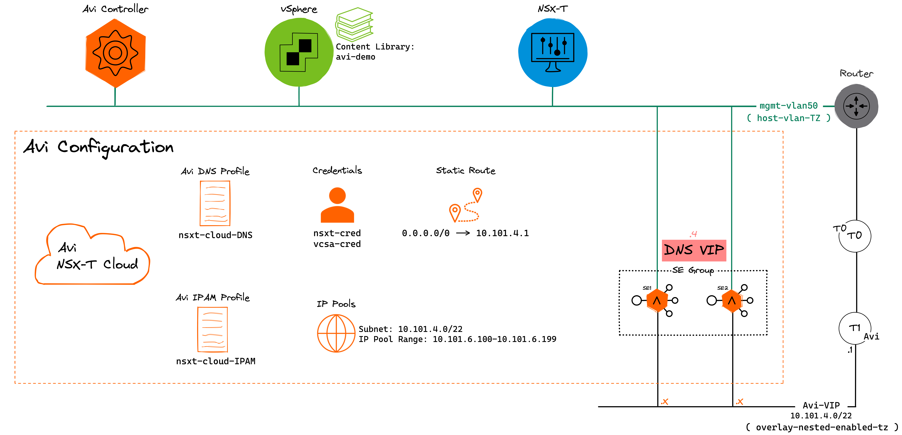

# AVI NSX-T Cloud Deployment with Terraform
Want to automate the configuration of Avi's NSX-T Cloud Connector? This repo contains TF files that will configure Avi's NSX-T Cloud including: IPAM & DNS Profiles, IP Pool, and deploying a DNS virtual service. From a topology perspective the SE management nic is placed on a NSX-T VLAN backed segment called "mgmt-vlan50" while the SE data nic is placed on a NSX-T Overlay segment called "Avi-VIP".

# Topology
Below is the topology. Terraform will provision/configure all Avi objects within the Avi configuration box.


# Environment
VMware software used:
* Avi v21.1.3
* vSphere v7.0.3.00100
* NSX-T v3.1.1.0.0.17483185


<!-- BEGINNING OF PRE-COMMIT-TERRAFORM DOCS HOOK -->
## Requirements

| Name | Version |
|------|---------|
| terraform | 1.1.6 |


## Providers

| Name | Version |
|------|---------|
| time | 0.7.2 |
| vsphere | 2.1.0 |
| avi | 21.1.3 |
| nsxt | 3.2.5 |

# Terraform.tfvars Example
```hcl
avi_username = "admin"
avi_password = "AVI PASSWORD HERE"
avi_controller = "AVI CONTROLLER IP/FQDN HERE"
avi_version = "21.1.3"
tenant = "admin"
cloud_name = "nsxtcloud"
avi_DNS_profile_name = "nsxt-cloud-DNS"
avi_IPAM_profile_name = "nsxt-cloud-IPAM"
data_avi_network_avi_vip_name = "Avi-VIP"
data_avi_applicationprofile_system_dns_name = "System-DNS"
nsxt_cloud_cred_name = "nsxt-cloud_cred"
vcsa_cred_name = "vcsa-cred"
dns_vip_name = "tf-dns"
vsphere_user = "administrator@vsphere.local"
vsphere_password = "VCENTER PASSWORD HERE"
vsphere_server = "VCENTER IP/FQDN HERE"
content_library_name = "avi-demo"
nsxt_cloud_url = "NSXT MANAGER IP/FQDN HERE"
nsxt_cloud_username = "admin"
nsxt_cloud_password = "NSXT MANAGER PASSWORD HERE"
nsxt_cloud_prefix = "tf"
nsxt_cloud_vcenter_name = "vcsa"
nsxt_cloud_mgmt_tz_name = "host-vlan-tz"
nsxt_cloud_data_tz_name = "overlay-nested-enabled-tz"
nsxt_cloud_mgmt_tz_type = "VLAN"
nsxt_cloud_vlan_seg = "mgmt-vlan50"
nsxt_cloud_data_tz_type = "OVERLAY"
nsxt_cloud_lr1 = "Avi"
nsxt_cloud_overlay_seg = "Avi-VIP"
nsxt_cloud_vip_subnet = "10.101.4.0"
nsxt_cloud_vip_subnet_mask = "22"
nsxt_cloud_vip_subnet_pool_begin = "10.101.6.100"
nsxt_cloud_vip_subnet_pool_end = "10.101.6.200"
vs_name = "tf-dns"
vs_vip_static_address = "10.101.4.4"
vs_port = "53"
```

<!-- END OF PRE-COMMIT-TERRAFORM DOCS HOOK -->